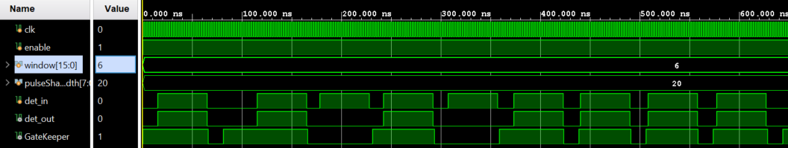
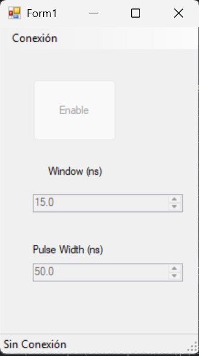

# GateKeeper
When pumping a nonlinear cystal with a CW laser is not easy to track the time distribution of detection events. It is likely to measure two consecutive detection signals in a short time window, which it is not good for some experimental setups. This is an FPGA project based on a Zynq7000 Zedboard meant to to discard consecutive detection signals.

Jitter ~ 300 ps

- Power FPGA with 12V.
- Plug a USB cable to the FPGA, configure the baud rate at 115200. 
- Use GUI/GateKeeperGUI/bin/Debug/GateKeeperGUI.exe to control the parameters
- Alternatively you can use the python project to set the parameters

